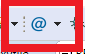

## Kurulum
---
Aşağıdaki paketlerin "Eclipse Marketplace" üzerinden kurulumu yapılır.

* Eclox
* Markdown View

Eclox ile Doxygen tipi sayesinde Doxygen yorumları oto-tamamlama özelliği açılır:
  
Eclipse Menu → (Window →) Preferences → C/C++ → Editor → Workspace Default : Doxygen seçilir.

Bu ayar sonrası fonksiyon başında `/**` yazılması durumunda doxygen yorumları otomatik olarak eklenecektir.

## Kullanım
---
Yeni Doxygen projeleri (doxyfile) oluşturmak için aşağıdaki yol izlenir. 

Eclipse Menu → File -> New -> Other -> Other -> Doxyfile

Oluşturulan Doxyfile üzerine çift tıklanarak editörü açılır.

Yapılabilecek bazı ayarlar şunlardır:

* Proje Adı , Versiyonu
* Proje Çıktıları sadece HTML olacak şekilde ayarlanabilir.
* Optimize results for → C
* Proje Çıktıları sadece HTML bölümünde (wih frames and navigation tree) seçilebilir.  

### Derleme

Doxygen dökümanları toolbardan  işaretine basılarak derlenir. Çıktılar **html** klasörü altındadır.

### Ana Sayfa Oluşturma

Doxygen dökümanının ana sayfası markdown formatında oluşturulabilir. Bunun için *.md uzantılı bir dosya oluşturulur ve dosyanın başına doxygenin algılaması için `@mainpage` yazıması gerekmektedir.

Örnek mainpage.md dosyası:

    @mainpage Project title
    This is the main page for the project. 
      
    1. Describe the project in general and the components/ modules it has
    2. Explain each module using data flow and software architecture diagrams
    3. Place links for each of the sub module's markdown pages    
    
    
## Kaynaklar
---
https://gnu-mcu-eclipse.github.io/eclipse/workspace/preferences/  
https://anb0s.github.io/eclox/  
https://github.com/adam-p/markdown-here/wiki/Markdown-Cheatsheet  

